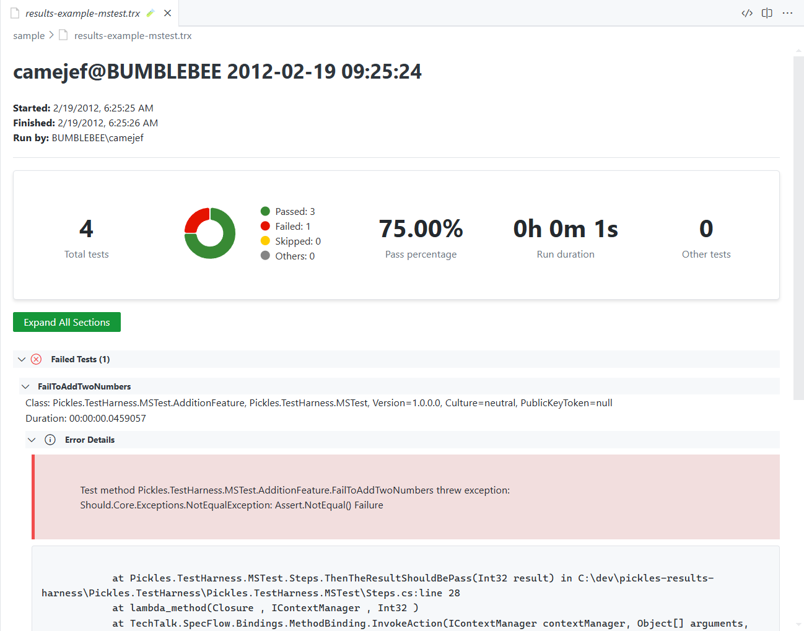

# TRX file viewer

This is a simple renderer for VS Code of the TRX test result file format. When installed if you have a `.trx` file, this extension will offer to open and render it for you.

It will parse the TRX file and visualize total, passing, failing, and other (skipped, notexecuted) results in summary, with the ability to expand each test to see output or other details as reported.

In action...

